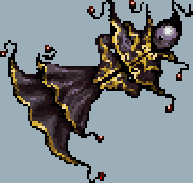

# 🐭 Chuột

[](https://github.com/tversteeg/chuot/actions?workflow=CI)
[](https://crates.io/crates/chuot)
[](https://docs.rs/chuot)
[](#license)
[](https://deps.rs/repo/github/tversteeg/chuot)
[](#downloads)
[](https://matrix.to/#/#chuot:matrix.org)

### [Website](https://tversteeg.nl/chuot/)

<!-- cargo-rdme start -->

AGPL licensed and opinionated game engine for 2D pixel-art games.

#### Features

- Pixel-perfect pixel art rendering with built-in rotsprite rotation shader.
- Window creation with independent update and render game loop.
- Hot-reloadable assets, seeing your assets update live in the game when you save them is a great boost in productivity for quickly iterating on ideas.
- Single-binary, all non-texture assets will be embedded directly, and textures will be diced into a single atlas map embedded in the binary when deploying.
- Simple bitmap font drawing.
- OGG audio playback.
- First-class gamepad support.
- Separate managed camera systems for UI and game elements.

#### Goals

- Ergonomic API with a focus on quickly creating small games, especially for game jams.
- Reasonable performance, drawing thousands of animated sprites at the same time shouldn't be a problem.
- Proper web support, it should be very easy to bundle as WASM for the web.

#### Non-Goals

- An ECS (Entity component system), although an ECS architecture is great for cache locality and thus performance, I feel that it's overkill for most small games. Nothing is stopping you to add your own on top of this engine if that's what you want though!
- 3D, this engine is only for 2D pixel art.
- Vector graphics, similar to the above, this engine is focused specifically on pixel art with lower resolutions.
- Reinventing the wheel for everything, when there's a proper crate with good support I prefer to use that instead of creating additional maintainer burden.
- Support all possible file formats, this bloats the engine.

#### Usage

Using this crate is quite simple, there is a single trait [`Game`] with two required functions, [`Game::update`] and [`Game::render`], that need to be implemented for a game state object.

```rust
use chuot::{Config, Context, Game};

struct MyGame;

impl Game for MyGame {
    fn update(&mut self, ctx: Context) {
        // ..
    }

    fn render(&mut self, ctx: Context) {
        // ..
    }
}

// In main

let game = MyGame;

game.run(chuot::load_assets!(), Config::default());
```

#### Features

##### `embed-assets`

Embed all assets into the binary when building.

_Must_ be enabled when building for the web.
If disabled all assets will be loaded from disk.

This will dice all PNG assets into a single tiny optimized PNG atlas.
On startup this diced atlas will be efficiently uploaded to the GPU as a single bigger atlas, which will be used for all static sprites.

##### `read-texture` (default)

Expose read operations on images, if disabled sprites will be uploaded to the GPU and their data will be removed from memory.

#### Install Requirements

On Linux you need to install `asound2-dev` for audio and `udev-dev` for gamepads:

```sh
sudo apt install libasound2-dev libudev-dev
```

#### Example

This example will show a window with a counter that's incremented when pressing the left mouse button[^left-mouse].
The counter is rendered as text[^text] loaded from a font in the top-left corner.
When the 'Escape' key is pressed[^escape-key] the game will exit and the window will close.

```rust
use chuot::{Game, Context, Config, MouseButton, KeyCode};

/// Object holding all game state.
struct MyGame {
  /// A simple counter we increment by clicking on the screen.
  counter: u32,
}

impl Game for MyGame {
  fn update(&mut self, ctx: Context) {
    // ^1
    // Increment the counter when we press the left mouse button
    if ctx.mouse_pressed(MouseButton::Left) {
      self.counter += 1;
    }

    // ^3
    // Exit the game if 'Escape' is pressed
    if ctx.key_pressed(KeyCode::Escape) {
      ctx.exit();
    }
  }

  fn render(&mut self, ctx: Context) {
    // ^2
    // Display the counter with a font called 'font' automatically loaded from the `assets/` directory
    // It will be shown in the top-left corner
    ctx.text("font", &format!("Counter: {}", self.counter)).draw();
  }
}

// In main

// Initialize the game state
let game = MyGame { counter: 0 };

// Run the game until exit is requested
game.run(chuot::load_assets!(), Config::default().with_title("My Game"));
```

[^left-mouse]: [`Context::mouse_pressed`]
[^text]: [`Context::text`]
[^escape-key]: [`Context::key_pressed`]

<!-- cargo-rdme end -->

#### Rotation Algorithms

In the library it's possible to choose between multiple upscale implementations for the single-pass RotSprite algorithm, see the Rust documentation for more information:

##### Nearest Neighbor

This doesn't apply any extra rotation effects.


##### cleanEdge


##### Scale3x (default)



##### Diag2x


##### Scale2x


#### Credits

- [Torcado](https://torcado.com/cleanEdge/) for the awesome cleanEdge algorithm.
- [gtoknu](https://www.shadertoy.com/view/4l2SRz) for the branchless scale2x shader.
- [@damieng](https://damieng.com/typography/zx-origins/beachball/) for the font behind the `default-font` feature.
- [KenneyNL](https://kenney.nl/assets/ui-audio) for the audio sample in the example.
